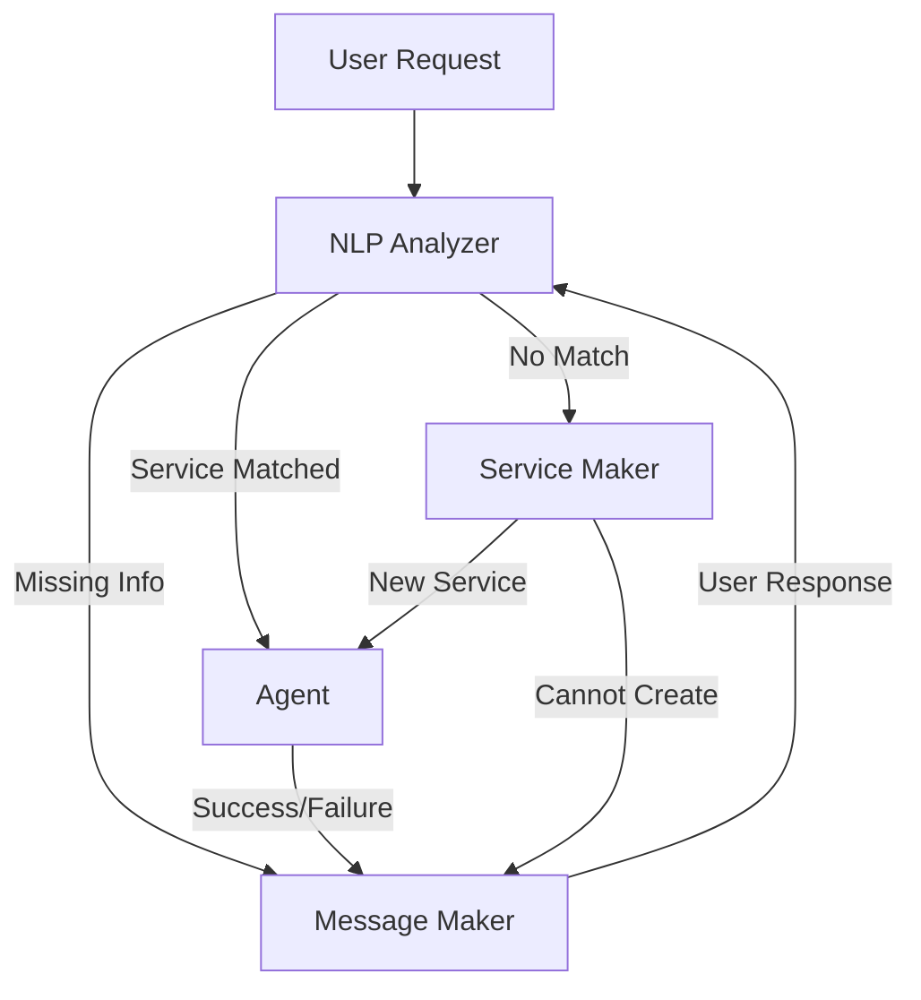
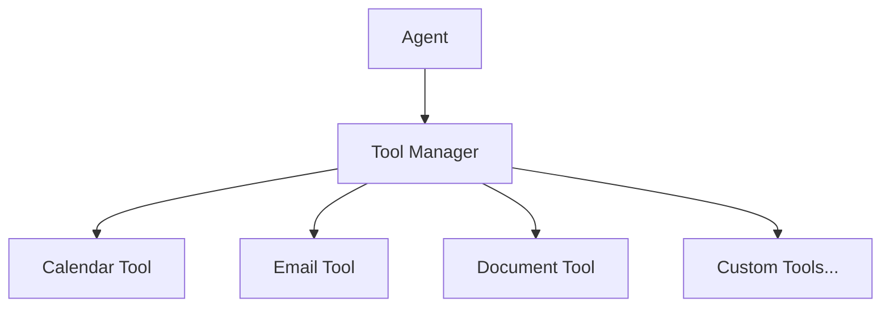

# AI Office Assistant

An intelligent Slack-based office assistant that handles tasks using natural language processing and a modular tool system.

## Architecture Overview

The system is built around four core components that work together to handle user requests:

1. **NLP Analyzer**: Processes incoming Slack messages to identify intent and extract entities using a local lexicon
2. **Agent**: Executes services by coordinating and using the appropriate tools
3. **Message Maker**: Generates and sends user messages via Slack using GPT
4. **Service Maker**: Creates new services using GPT-4 by analyzing available tools

### Key Concepts

- **Tools**: Modular components that provide specific functionality (e.g., calendar management, email handling)
- **Services**: Step-by-step instructions that use tools to accomplish specific tasks
- **Single-Task Focus**: The system handles one task at a time, maintaining focus until completion

## System Flow



### Detailed Flow Description

1. **Known Service Flow**
   ```mermaid
   sequenceDiagram
       User->>NLP: Makes request
       NLP->>Agent: Service + Variables
       Agent->>Tools: Execute steps
       Tools->>Agent: Results
       Agent->>MessageMaker: Success/Failure
       MessageMaker->>User: Completion message
   ```

2. **Missing Information Flow**
   ```mermaid
   sequenceDiagram
       User->>NLP: Makes request
       NLP->>MessageMaker: Missing info needed
       MessageMaker->>User: Request for info
       User->>NLP: Provides info
       NLP->>Agent: Complete service + variables
       Agent->>MessageMaker: Success/Failure
       MessageMaker->>User: Completion message
   ```

3. **New Service Creation Flow**
   ```mermaid
   sequenceDiagram
       User->>NLP: Makes request
       NLP->>ServiceMaker: Unknown intent
       ServiceMaker->>ServiceMaker: Analyze tools
       ServiceMaker->>Agent: New service
       Agent->>Tools: Execute steps
       Tools->>Agent: Results
       Agent->>MessageMaker: Success/Failure
       MessageMaker->>User: Completion message
   ```

## Component Details

### NLP Analyzer
- Processes incoming Slack messages
- Uses local lexicon to identify intents
- Extracts entities and variables
- Routes requests based on analysis results

### Agent
- Maintains single-task focus using busy state
- Executes services step by step
- Coordinates tool usage
- Validates success criteria
- Reports execution results

### Message Maker
- Generates user-friendly messages using GPT
- Handles different message types:
  - Information requests
  - Success notifications
  - Error messages
  - Status updates

### Service Maker
- Creates new services using GPT-4
- Analyzes available tools and capabilities
- Generates step-by-step instructions
- Validates service structure and requirements

## Tools System

Tools are modular components that provide specific functionality:



Each tool:
- Has a clear single responsibility
- Provides specific actions
- Returns standardized results
- Is easily extensible

## Development

### Prerequisites
- Python 3.11+
- Slack Bot Token
- OpenAI API Key

### Setup
1. Clone the repository
2. Create a virtual environment:
   ```bash
   python -m venv .venv
   source .venv/bin/activate  # Linux/Mac
   # or
   .venv\Scripts\activate  # Windows
   ```
3. Install dependencies:
   ```bash
   pip install -r requirements.txt
   ```
4. Set up environment variables:
   ```bash
   export SLACK_BOT_TOKEN="your-token"
   export OPENAI_API_KEY="your-key"
   ```

### Running Tests
```bash
python -m pytest tests/
```

## Contributing

1. Fork the repository
2. Create a feature branch
3. Make your changes
4. Run tests
5. Submit a pull request

## License

MIT License - See LICENSE file for details