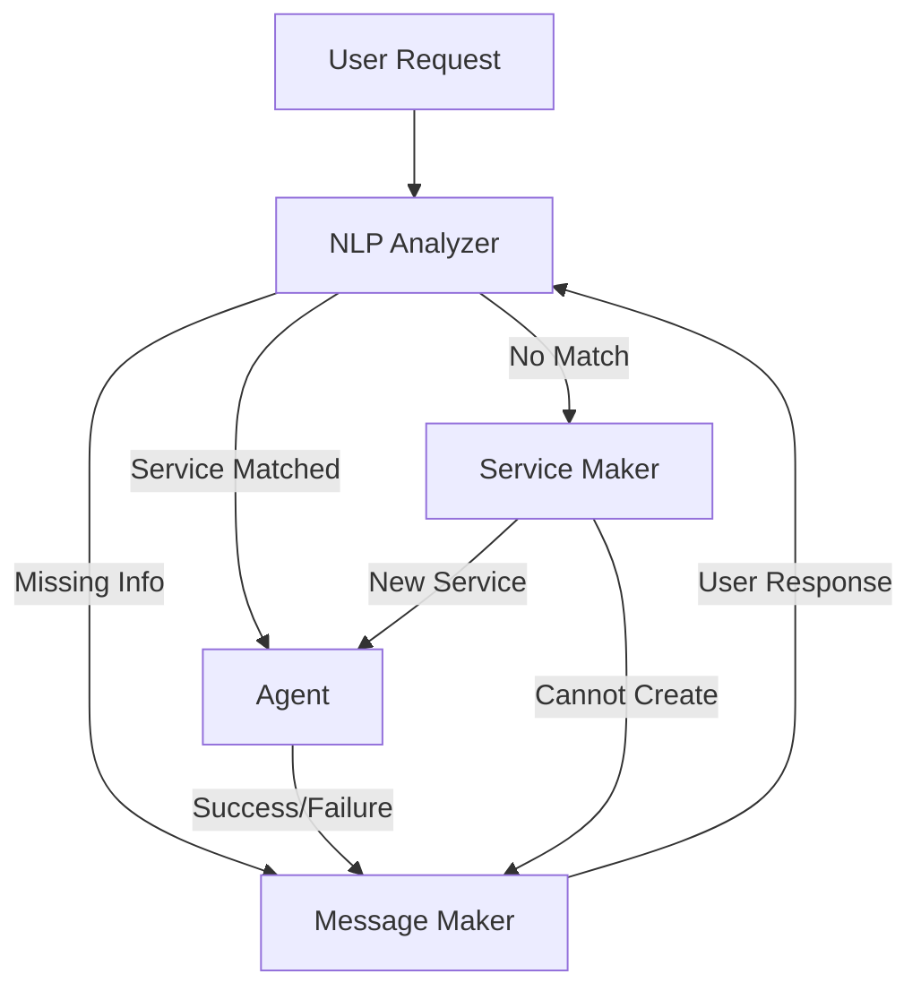
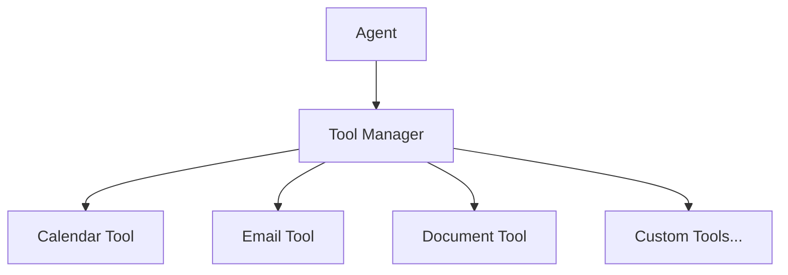

<<<<<<< HEAD
# AI Office Assistant

An intelligent Slack-based office assistant that handles tasks using natural language processing and a modular tool system.

## Architecture Overview

The system is built around four core components that work together to handle user requests:

1. **NLP Analyzer**: Processes incoming Slack messages to identify intent and extract entities using a local lexicon
2. **Agent**: Executes services by coordinating and using the appropriate tools
3. **Message Maker**: Generates and sends user messages via Slack using GPT
4. **Service Maker**: Creates new services using GPT-4 by analyzing available tools

### Key Concepts

- **Tools**: Modular components that provide specific functionality (e.g., calendar management, email handling)
- **Services**: Step-by-step instructions that use tools to accomplish specific tasks
- **Single-Task Focus**: The system handles one task at a time, maintaining focus until completion

## System Flow


```mermaid
graph TD
    A[User Request] --> B[NLP Analyzer]
    B -->|Service Matched| C[Agent]
    B -->|Missing Info| D[Message Maker]
    B -->|No Match| E[Service Maker]
    C -->|Success/Failure| D
    D -->|User Response| B
    E -->|New Service| C
    E -->|Cannot Create| D
```

### Detailed Flow Description

1. **Known Service Flow**
   ```mermaid
   sequenceDiagram
       User->>NLP: Makes request
       NLP->>Agent: Service + Variables
       Agent->>Tools: Execute steps
       Tools->>Agent: Results
       Agent->>MessageMaker: Success/Failure
       MessageMaker->>User: Completion message
   ```

2. **Missing Information Flow**
   ```mermaid
   sequenceDiagram
       User->>NLP: Makes request
       NLP->>MessageMaker: Missing info needed
       MessageMaker->>User: Request for info
       User->>NLP: Provides info
       NLP->>Agent: Complete service + variables
       Agent->>MessageMaker: Success/Failure
       MessageMaker->>User: Completion message
   ```

3. **New Service Creation Flow**
   ```mermaid
   sequenceDiagram
       User->>NLP: Makes request
       NLP->>ServiceMaker: Unknown intent
       ServiceMaker->>ServiceMaker: Analyze tools
       ServiceMaker->>Agent: New service
       Agent->>Tools: Execute steps
       Tools->>Agent: Results
       Agent->>MessageMaker: Success/Failure
       MessageMaker->>User: Completion message
   ```

## Component Details

### NLP Analyzer
- Processes incoming Slack messages
- Uses local lexicon to identify intents
- Extracts entities and variables
- Routes requests based on analysis results

### Agent
- Maintains single-task focus using busy state
- Executes services step by step
- Coordinates tool usage
- Validates success criteria
- Reports execution results

### Message Maker
- Generates user-friendly messages using GPT
- Handles different message types:
  - Information requests
  - Success notifications
  - Error messages
  - Status updates

### Service Maker
- Creates new services using GPT-4
- Analyzes available tools and capabilities
- Generates step-by-step instructions
- Validates service structure and requirements

## Tools System

Tools are modular components that provide specific functionality:


```mermaid
graph TD
    A[Agent] --> B[Tool Manager]
    B --> C[Calendar Tool]
    B --> D[Email Tool]
    B --> E[Document Tool]
    B --> F[Custom Tools...]
```

Each tool:
- Has a clear single responsibility
- Provides specific actions
- Returns standardized results
- Is easily extensible

## Development

### Prerequisites
- Python 3.11+
- Slack Bot Token
- OpenAI API Key

### Setup
1. Clone the repository
2. Create a virtual environment:
   ```bash
   python -m venv .venv
   source .venv/bin/activate  # Linux/Mac
   # or
   .venv\Scripts\activate  # Windows
   ```
3. Install dependencies:
   ```bash
   pip install -r requirements.txt
   ```
4. Set up environment variables:
   ```bash
   export SLACK_BOT_TOKEN="your-token"
   export OPENAI_API_KEY="your-key"
   ```

### Running Tests
```bash
python -m pytest tests/
```
=======
# AI Secretary

An intelligent virtual assistant system that automates tasks through Slack integration, powered by GPT and modular service architecture. Perfect for both personal and business use.

## Overview

AI Secretary is a powerful automated assistant that processes natural language requests through Slack, understands intent, and executes complex tasks using a modular service architecture. It combines the power of GPT models with a flexible tool system to handle both predefined and novel tasks.

## System Architecture

The Brain consists of 4 main components & 4 main documents:

Main components:

   1. NLP Analyzer

      The NLP Analyzer processes incoming messages to:
      - Identify user intents using a dynamic lexicon built from service definitions
      - Extract entities like time, date, participants, and locations
      - Handle complex time formats with automatic 24-hour conversion
      - Support fuzzy matching for intent recognition
      - Track missing required entities for better user interaction

   2. Agent Executor

      The Agent handles service execution with:
      - Dynamic tool loading and caching
      - Step-by-step execution with context preservation
      - Sophisticated error handling and recovery
      - Support for conditional execution and loops
      - Parameter formatting with context-aware substitution
      - Comprehensive logging of execution flow

   3. **Message Maker**
      - Generates contextual responses using GPT
      - Manages Slack communication
      - Handles user interaction and feedback

   4. **Service Maker**
      - Creates new services for novel requests
      - Uses advanced GPT with tool awareness
      - Converts user needs into executable workflows
      - Handles execution troubleshooting and error recovery
      - Updates documentation with new services 

Main documents:

   1. **Services.yaml**
      - Defines all available services
      - Includes service names, descriptions, and required parameters

   2. **Executions.yaml**
      - Maps services to execution plans
      - Defines step-by-step workflows
      - Includes conditional logic and error handling

   3. **Capabilities Index**
      The system maintains a dynamic capabilities index that:
      - Tracks available services and their requirements
      - Maps intents to service executions
      - Provides structured service definitions
      - Supports trigger phrases for natural interaction
      - Manages required and optional entities

   4. **module_capabilities.txt**
      - Detailed documentation for all modules
      - Includes module purposes, capabilities, and required parameters

## Service Structure

Services are defined in YAML with:
```yaml
service_name:
  name: Human-readable name
  description: Service description
  intent: Primary intent
  triggers:
    - Natural language triggers
    - Alternative phrasings
  required_entities:
    - Required parameters
  optional_entities:
    - Optional parameters
```

## Request Flow Diagrams

### Flow 1: Successful Service Match
```
User Request (Slack)
       ↓
    NLP Analysis
       ↓
   Service Match → Agent
       ↓             ↓
    Execute Tools    ↓
       ↓             ↓
   Verify Success    ↓
       ↓             ↓
   Message Maker ← Result
       ↓
Response (Slack)
```

### Flow 2: Missing Information
```
User Request (Slack)
       ↓
    NLP Analysis
       ↓
 Incomplete Match
       ↓
   Message Maker
       ↓
Request Info (Slack)
       ↓
 User Response → [Back to NLP Analysis]
```

### Flow 3: New Service Creation
```
User Request (Slack)
       ↓
    NLP Analysis
       ↓
   No Service Match
       ↓
   Service Maker
       ↓
[Success] → New Service → Agent
   ↓
[Failure] → Message Maker
       ↓
Response (Slack)
```

### Flow 4: Service Error Recovery
```
User Request (Slack)
       ↓
    NLP Analysis
       ↓
   Service Match → Agent
       ↓             ↓
    Execute Tools    ↓
       ↓             ↓
   Error Occurs ─────┘
       ↓
   Service Maker
       ↓
[Can Fix] → New Solution → Agent
   ↓
[Cannot Fix] → Message Maker
       ↓
Response (Slack)
```

## Core Capabilities

### Communication
- Slack integration for user interaction
- Natural language understanding
- Context-aware responses
- Multi-channel notifications

### Task Management
- Calendar operations (Google Calendar)
- Email management (Gmail)
- Document handling (Google Docs/Drive)
- Task tracking (Trello)

### Data Processing
- Web scraping and data extraction
- File format conversion
- Data cleaning and normalization
- Report generation

### System Integration
- Google Workspace integration
- Trello project management
- File transfer and organization
- Session and credential management

### AI Features
- GPT-powered response generation
- Dynamic service creation
- Intent recognition
- Entity extraction

## Setup and Configuration

### Prerequisites
- Python 3.8+
- Slack workspace with admin access
- Google Workspace account
- OpenAI API key
- Trello API credentials

### Environment Variables
```bash
SLACK_BOT_TOKEN=your-slack-bot-token
SLACK_APP_TOKEN=your-slack-app-token
OPENAI_API_KEY=your-openai-api-key
GOOGLE_APPLICATION_CREDENTIALS=path/to/credentials.json
TRELLO_API_KEY=your-trello-api-key
TRELLO_TOKEN=your-trello-token
```
## Getting Started

1. Clone the repository
2. Install dependencies: `pip install -r requirements.txt`
3. Configure services in `src/services/services.yaml`
4. Define execution plans in `src/services/executions.yaml`
5. Run tests: `python -m pytest tests/`
```

## Module Documentation

Detailed documentation for all modules can be found in `services/module_capabilities.txt`. This includes:
- Module purposes and capabilities
- Required and optional parameters
- Output formats
- Dependencies
- Common workflows
- Error handling strategies
>>>>>>> main

## Contributing

1. Fork the repository
2. Create a feature branch
<<<<<<< HEAD
3. Make your changes
4. Run tests
5. Submit a pull request

## License

MIT License - See LICENSE file for details
=======
3. Commit your changes
4. Push to the branch
5. Create a Pull Request

## License

This project is licensed under the MIT License - see the LICENSE file for details.

## Support

For support, please:
1. Check the module documentation
2. Review existing issues
3. Create a new issue with detailed information

## Acknowledgments

- OpenAI for GPT models
- Slack for their excellent API
- Google for Workspace integration
- Trello for project management capabilities
>>>>>>> main
