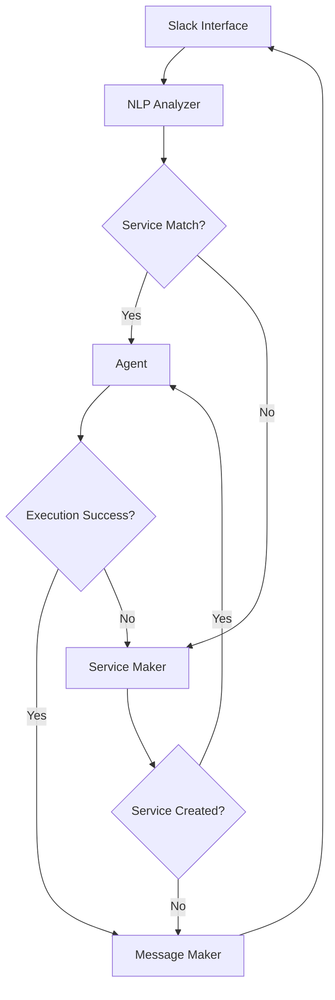
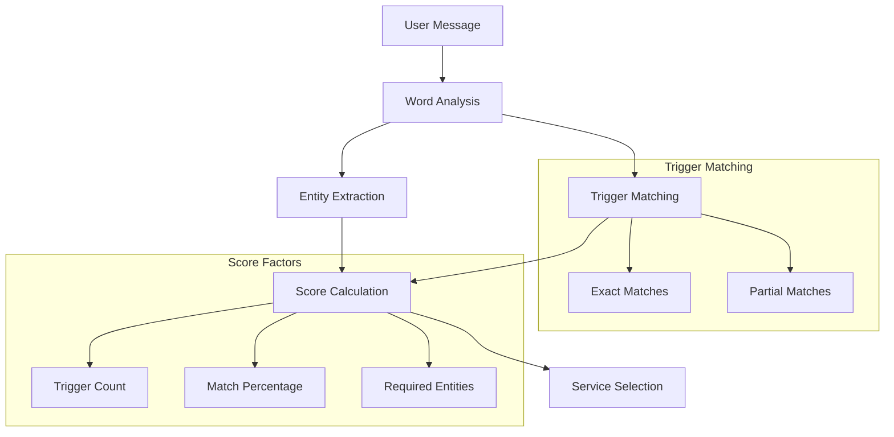
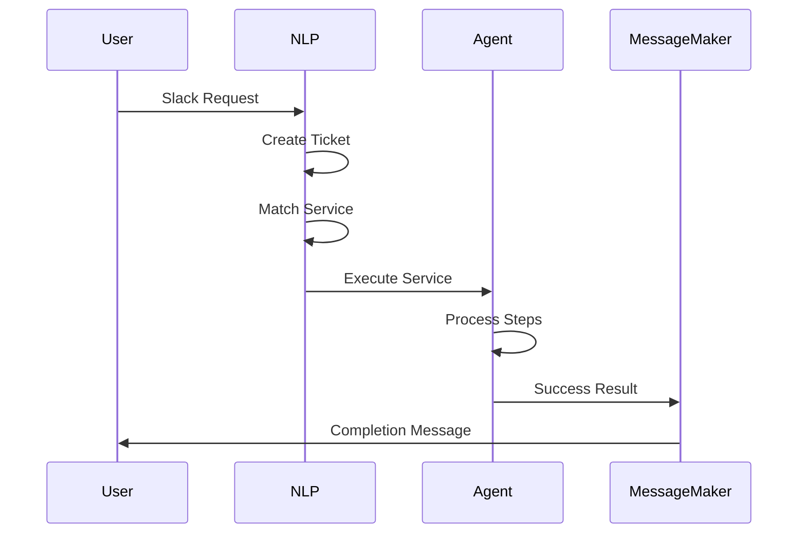
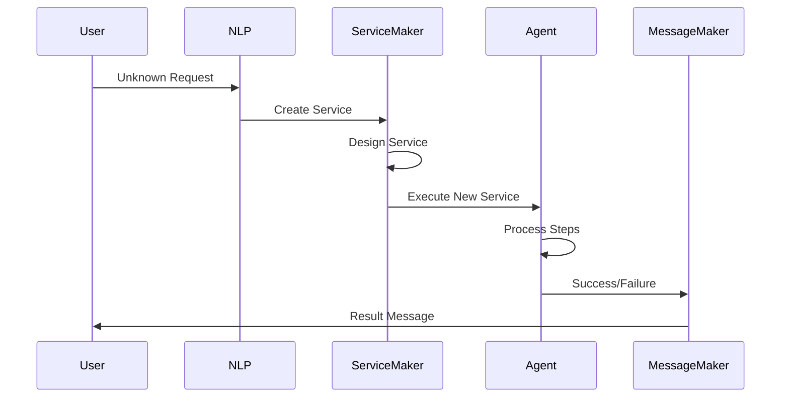
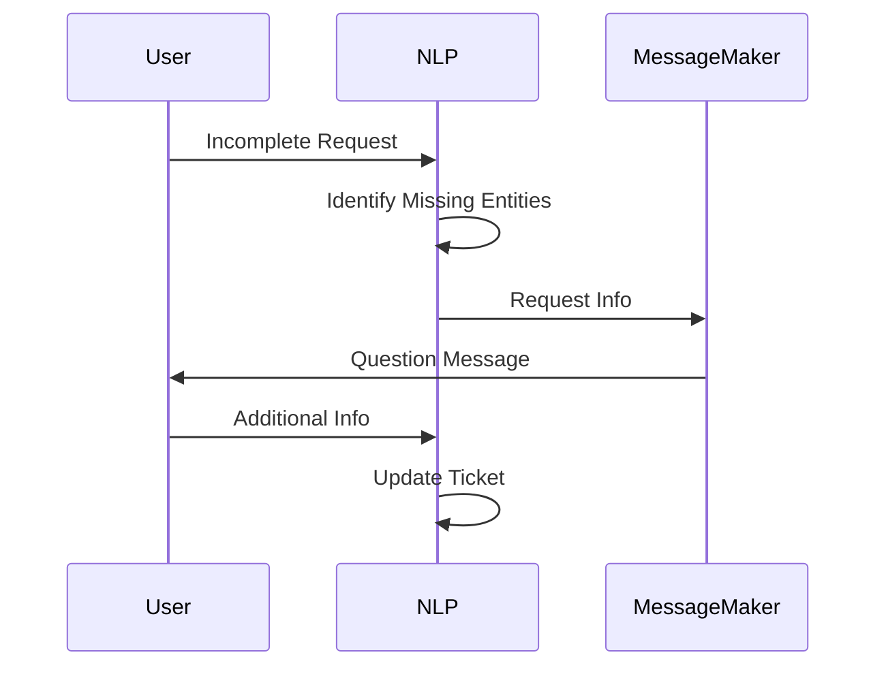

# AI Secretary

An intelligent AI-powered secretary that can automate any computer-based task through natural language requests via Slack.

## Overview

AI Secretary is a sophisticated system that processes natural language requests from Slack, automatically executes tasks using existing service definitions, and can even create new services on the fly when encountering novel requests. It acts as a bridge between human intent and computer execution, making task automation accessible through simple conversation.

## Architecture

The system consists of several core components that work together to process and execute user requests:


```mermaid
graph TD
    A[Slack Interface] --> B[NLP Analyzer]
    B --> C{Service Match?}
    C -->|Yes| D[Agent]
    C -->|No| E[Service Maker]
    E --> F{Service Created?}
    F -->|Yes| D
    D --> G{Execution Success?}
    G -->|Yes| H[Message Maker]
    G -->|No| E
    H --> A
    F -->|No| H
```

### Core Components

1. **NLP Analyzer** (`src/tools/nlp.py`)
   - Processes incoming Slack messages
   - Identifies intents and extracts entities
   - Creates and manages request tickets
   - Matches requests to existing services

2. **Agent** (`src/tools/agent.py`)
   - Executes service definitions
   - Manages tool interactions
   - Tracks execution progress
   - Handles errors and retries

3. **Service Maker** (`src/tools/service_maker.py`)
   - Creates new services for unknown requests
   - Uses GPT-4 for service design
   - Validates service definitions
   - Handles service recovery

4. **Message Maker** (`src/tools/message_maker.py`)
   - Generates user-friendly responses
   - Manages Slack communication
   - Formats execution results
   - Handles error messages

### Service Matching System

The NLP Analyzer uses a sophisticated scoring system to match user requests with appropriate services:

#### Scoring Mechanism

```mermaid
graph TD
    A[User Message] --> B[Word Analysis]
    B --> C[Trigger Matching]
    B --> D[Entity Extraction]
    C --> E[Score Calculation]
    D --> E
    E --> F[Service Selection]
    
    subgraph "Trigger Matching"
    C --> C1[Exact Matches]
    C --> C2[Partial Matches]
    end
    
    subgraph "Score Factors"
    E --> E1[Trigger Count]
    E --> E2[Match Percentage]
    E --> E3[Required Entities]
    end
```

The system scores potential service matches using multiple criteria:

1. **Trigger Matching**
   - Checks for exact matches between message words and service triggers
   - Considers partial matches (e.g., "schedule" in "scheduling")
   - Accumulates matches for each potential service

2. **Entity Analysis**
   - Identifies required entities in the message
   - Matches entities with service requirements
   - Considers both required and optional entities

3. **Scoring Weights**
   - Number of matched triggers (primary factor)
   - Percentage of service's triggers matched
   - Presence of required entities

4. **Selection Criteria**
   - Services must have at least one trigger match
   - Sorted by trigger count, match percentage, and entity presence
   - Best match is selected for execution

## Flow Diagrams

### Happy Path Flow

```mermaid
sequenceDiagram
    participant User
    participant NLP
    participant Agent
    participant MessageMaker
    
    User->>NLP: Slack Request
    NLP->>NLP: Create Ticket
    NLP->>NLP: Match Service
    NLP->>Agent: Execute Service
    Agent->>Agent: Process Steps
    Agent->>MessageMaker: Success Result
    MessageMaker->>User: Completion Message
```

### Service Creation Flow

```mermaid
sequenceDiagram
    participant User
    participant NLP
    participant ServiceMaker
    participant Agent
    participant MessageMaker
    
    User->>NLP: Unknown Request
    NLP->>ServiceMaker: Create Service
    ServiceMaker->>ServiceMaker: Design Service
    ServiceMaker->>Agent: Execute New Service
    Agent->>Agent: Process Steps
    Agent->>MessageMaker: Success/Failure
    MessageMaker->>User: Result Message
```

### Missing Information Flow

```mermaid
sequenceDiagram
    participant User
    participant NLP
    participant MessageMaker
    
    User->>NLP: Incomplete Request
    NLP->>NLP: Identify Missing Entities
    NLP->>MessageMaker: Request Info
    MessageMaker->>User: Question Message
    User->>NLP: Additional Info
    NLP->>NLP: Update Ticket
```

## Setup

### Prerequisites

- Python 3.8+
- Slack Workspace and Bot Token
- OpenAI API Key
- Required Python packages (see `requirements.txt`)

### Environment Variables

```bash
SLACK_BOT_TOKEN=your-slack-bot-token
OPENAI_API_KEY=your-openai-api-key
```

### Installation

1. Clone the repository
```bash
git clone https://github.com/yourusername/ai-secretary.git
cd ai-secretary
```

2. Install dependencies
```bash
pip install -r requirements.txt
```

3. Configure environment variables
```bash
cp .env.example .env
# Edit .env with your credentials
```

## Usage

### Basic Request Flow

1. Mention the bot in your Slack channel with a request:
```
@ai-secretary Schedule a meeting with John tomorrow at 2pm
```

2. The bot will either:
   - Execute the request if all information is available
   - Ask for additional information if needed
   - Create a new service if the request is novel
   - Inform you of any issues or constraints

### Example Requests

```
@ai-secretary Schedule a team meeting for tomorrow at 3pm
@ai-secretary Share the quarterly report with the marketing team
@ai-secretary Create a task to review the new design proposal
@ai-secretary Extract text from the attached PDF and email it to John
```

## Configuration

### Service Definitions
Services are defined in `src/services/services.yaml`. Each service includes:
- Triggers for request matching
- Required and optional entities
- Execution steps and tools
- Success criteria and error handling

### Capabilities
System capabilities are defined in `src/services/capacity_simple.yaml`, including:
- Available tools and actions
- Input/output specifications
- Resource requirements

## Development

### Adding New Capabilities

1. Define the capability in `capacity_simple.yaml`
2. Implement the tool in `src/tools/`
3. Update service definitions as needed

### Testing

Run the test suite:
```bash
pytest tests/
```

## Contributing

1. Fork the repository
2. Create a feature branch
3. Commit your changes
4. Push to the branch
5. Create a Pull Request

## License

[MIT License](LICENSE)

## Acknowledgments

- OpenAI for GPT models
- Slack for communication platform
